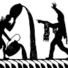

# Context Free Channel

- YouTube channel: https://youtube.com/@contextfree

Other things:

- Taca app runtime: https://github.com/contextfreeinfo/taca
- Languish trends: https://tjpalmer.github.io/languish/
- Discord: https://discord.gg/4yJM5MbcAp
- Mastodon: <a rel="me" href="https://hachyderm.io/@contextfree">https://hachyderm.io/@contextfree</a>
- Bluesky: https://bsky.app/profile/contextfree.bsky.social
- GitHub: https://github.com/contextfreecode
- Reddit: https://reddit.com/r/contextfree/

Link here via: https://contextfree.info/
